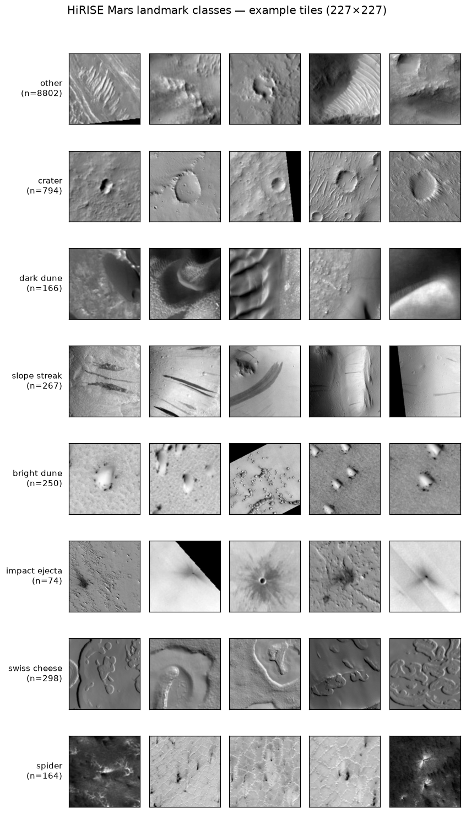
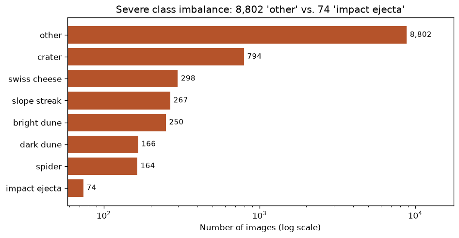
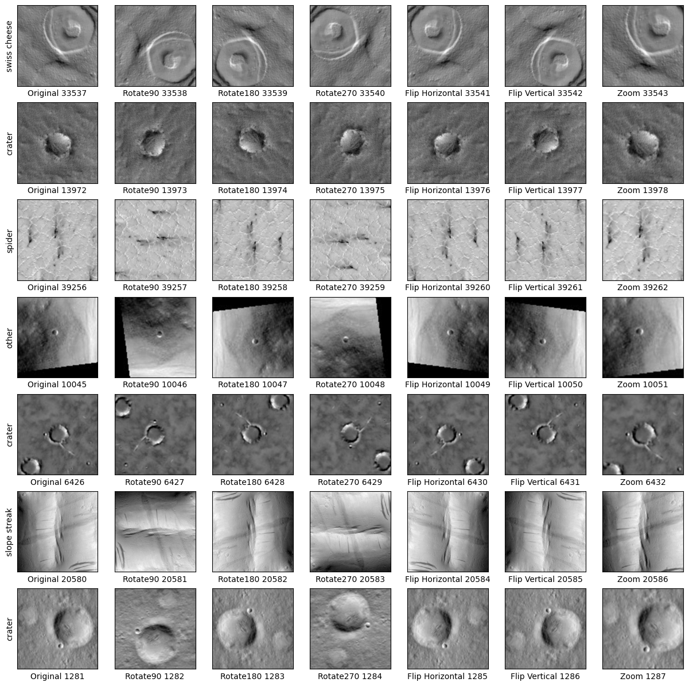

# Mars Surface Image Classification

Classifying geological landmarks on the surface of Mars from NASA HiRISE orbital imagery — and using it to answer a sharper question: **does handling class imbalance actually improve a CNN's performance?**

Developed as the final examination paper for the *Data Mining, Machine Learning, and Deep Learning* course (M.Sc. Business Administration & Data Science, Copenhagen Business School, 2023). The study benchmarks an SVM against two CNN architectures (AlexNet and GoogLeNet) and tests three hypotheses:

1. Neural networks classify these images better than an SVM.
2. A balanced training set yields better results than an imbalanced one.
3. ADASYN and Random Oversampling are suitable ways to balance image data for CNNs.

**Headline finding:** (1) holds emphatically; (2) and (3) do **not** — oversampling (ADASYN / Random Oversampling) gave no meaningful gain over training on the imbalanced data. The decisive factor was architecture: GoogLeNet beat AlexNet across the board.

## Problem

The [HiRISE](https://www.uahirise.org/) camera aboard NASA's Mars Reconnaissance Orbiter produces high-resolution images of the Martian surface. The task is to classify image tiles into **8 landmark classes**:

| Label | Class | Label | Class |
|------:|-------|------:|-------|
| 0 | other | 4 | bright dune |
| 1 | crater | 5 | impact ejecta |
| 2 | dark dune | 6 | swiss cheese |
| 3 | slope streak | 7 | spider |



The central challenge is **extreme class imbalance**: of the 10,815 image tiles, ~81% belong to class `other`, while rare classes such as `impact ejecta` have fewer than 75 examples.



## Dataset

The data is the publicly released NASA JPL *Mars orbital image (HiRISE) labeled data set, version 3.2* (Wagstaff et al., "Deep Mars"). It is included directly in this repository:

- **`map-proj-v3_2/`** — 10,815 grayscale image tiles (227×227), JPEG.
- **`labels-map-proj_v3_2.txt`** — image filename → class label.
- **`labels-map-proj_v3_2_train_val_test.txt`** — official train/validation/test split (includes augmented filename variants).
- **`landmarks_map-proj-v3_2_classmap.csv`** — label index → class name mapping.

> Filenames ending in `-fv`, `-fh`, `-brt`, `-r90`, `-r180`, `-r270` are flipped/brightened/rotated augmentations of base tiles and are filtered out during preprocessing.

## Approach

### Preprocessing & splitting
- Images loaded as grayscale, resized to **227×227**, normalized to `[0, 1]`.
- Stratified split: **60% train / 28% test / 12% validation** (6,489 / 3,028 / 1,298 images).
- ~4,500 majority-class (`other`) training samples removed to reduce the imbalance before resampling (final training set: 1,989 images).

### Handling class imbalance
Two oversampling strategies (from [`imbalanced-learn`](https://imbalanced-learn.org/)) are compared, each rebalancing every minority class up to the majority count:
- **Random Oversampling** — duplicates existing minority samples.
- **ADASYN** — synthesizes new minority samples adaptively in feature-dense regions.

A 7-fold image **augmentation** (rotations 90/180/270°, horizontal/vertical flips, zoom) is then applied to the training set only.



### Models
| Model | Library | Notes |
|-------|---------|-------|
| **SVM** | scikit-learn | On flattened pixels; grid search over `C ∈ {0.1,1,10}`, kernel ∈ {linear, rbf, poly}, gamma ∈ {0.1,1,scale}; 3-fold CV. Best: RBF, `C=10`, `gamma=scale`. |
| **AlexNet** | TensorFlow/Keras | 5 conv blocks + 2×4096 dense, dropout 0.5, softmax(8). |
| **GoogLeNet** | TensorFlow/Keras | Inception modules + global average pooling, softmax(8). |

CNNs trained with **SGD** (momentum 0.9, Nesterov, weight decay 5e-4), learning rates `{0.005, 0.01}`, batch sizes `{32, 128}`, up to 30 epochs.

## Results

Test-set accuracy (3,028 images) for the final 30-epoch CNN runs:

| Model | Imbalanced | Random Oversampling | ADASYN |
|-------|:----------:|:-------------------:|:------:|
| **AlexNet**   | 0.88 | 0.80 | 0.82 |
| **GoogLeNet** | 0.89 | 0.86 | 0.85 |

> ⚠️ **Read these numbers carefully.** The test set is left at its natural distribution, so **~82% of it is the majority `other` class** — a model could score 0.82 by always predicting `other`. Raw accuracy is therefore misleading; the fair yardstick is **macro-F1** (which weights all 8 classes equally). On that measure the honest result is that **oversampling did not help here**: macro-F1 was essentially flat across imbalanced / Random Oversampling / ADASYN (~0.69–0.70), and the three balancing variants were statistically indistinguishable. The decisive factor was **architecture** — GoogLeNet (macro-F1 ≈0.70) beat AlexNet (≈0.63) in every configuration, with the plain imbalanced GoogLeNet nominally highest (accuracy 0.89, macro-F1 0.70). Full per-class precision/recall/F1 is in the report's Table 3.

> *Note: the classification reports inside the notebooks have precision and recall swapped (a known variable-ordering bug, flagged in the report); the corrected figures live in the report. Macro-F1 is unaffected by the swap.*

The CNNs vastly outperform the SVM baseline, whose test accuracy collapsed on the rare classes (≈0.18 on balanced training) — illustrating why deep features are needed for this task.

## Repository structure

```
.
├── 00_Data_Preparation.ipynb        # Parse/clean metadata, build the labels table
├── 01_Support_Vector_Machine.ipynb  # SVM baseline (grid search + evaluation)
├── 02_Neural_Network.ipynb          # AlexNet & GoogLeNet (main deliverable)
│
├── map-proj-v3_2/                   # HiRISE image tiles (dataset)
├── labels-map-proj_v3_2.txt
├── labels-map-proj_v3_2_train_val_test.txt
├── landmarks_map-proj-v3_2_classmap.csv
│
├── experiments/                     # Exploratory notebooks
│   ├── augmentations.ipynb          # Image augmentation experiments
│   ├── oversampling_comparison.ipynb
│   └── z0{1..4}_*.ipynb             # Per-model × per-oversampling experiments
│
└── Results/
    ├── final-models/                # The six final 30-epoch runs (per table above)
    └── grid-search/                 # Hyperparameter sweep (model × oversampling × bs × lr)
```

## Running the notebooks

The notebooks were developed in **Google Colab** (GPU runtime) and read the dataset from the repository paths above. To run locally:

```bash
python3 -m venv .venv && source .venv/bin/activate
pip install -r requirements.txt
jupyter lab
```

Training the CNNs requires a GPU and several hours (GoogLeNet runs took ~9–10 h); the committed notebooks already contain their outputs (metrics, training curves, sample plots) so the results are viewable without re-running.

## Team & report

Final examination paper for the M.Sc. *Business Administration and Data Science* programme at Copenhagen Business School (2023), by **Leonard Brenk**, **Finn Feddersen**, and **Felix Wltschek** (supervisors: Somnath Mazumdar, Raghava Rao Mukkamala).

📄 The full 13-page report is available on request — [feddersen-net.com](https://feddersen-net.com).

## Acknowledgements

Dataset courtesy of NASA/JPL-Caltech and the *Deep Mars* effort (Wagstaff et al.). The HiRISE imagery is publicly available for research and educational use.
